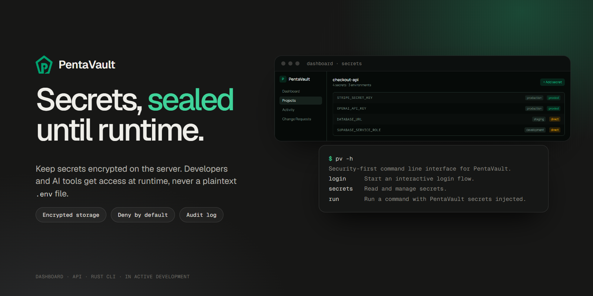
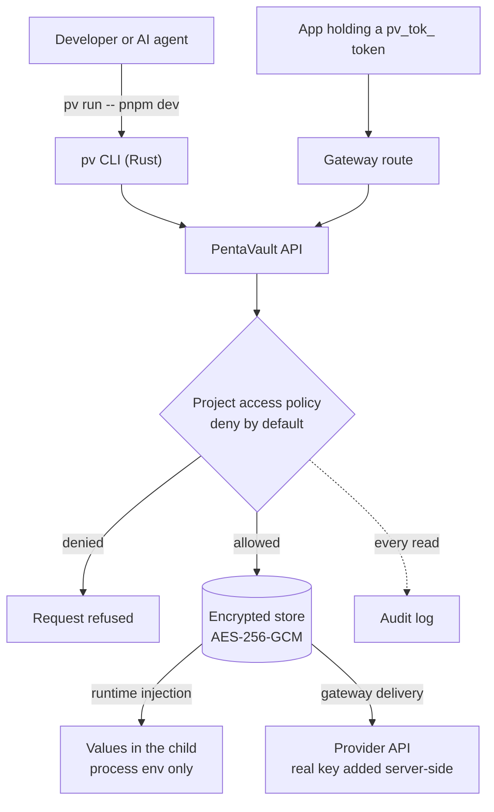

<p align="center">
  
</p>

# PentaVault

**Keep secrets encrypted on the server and hand them to developers, apps and AI coding tools only at runtime.**

PentaVault is a control plane for runtime secrets: encrypted storage, deny-by-default project
access, revocable proxy tokens, runtime injection through a Rust CLI, and an audit trail of who
read what. It is in active development.

## The problem

Most projects keep their API keys and database URLs in a plaintext `.env` file on every
developer's machine. That was always a little risky. With AI coding assistants and agents reading
the whole workspace, it is a leak path: anything in the folder can end up in a prompt, a log or a
commit.

PentaVault's goals:

- remove plaintext secrets from local env files
- give each person revocable, per-user proxy tokens instead of raw keys
- for supported providers, deliver requests through a gateway so the real key never reaches the
  developer's machine
- for everything else, inject secrets into the process at runtime instead of writing them to disk
- make audit, revoke and access control easy enough for a small team to use every day

## How it works



- **Encrypted storage.** Secret values are sealed with envelope encryption: a random data key per
  value, AES-256-GCM, and the data key wrapped by a key-encryption key. The database holds only
  ciphertext, IV, auth tag and the wrapped key.
- **Deny-by-default access.** Every read goes through a central project access policy on the
  server. Organisation and project roles decide who can read, write and approve. Dashboard gates
  are only UX; the backend enforces them.
- **Proxy tokens.** Apps can hold a `pv_tok_` token instead of the provider key. Tokens are
  stored hashed, shown once at issue, and can be revoked without redeploying.
- **Runtime injection.** `pv run -- <command>` fetches the values after the policy check and
  passes them to the child process's environment. Nothing is written to a `.env` file or to the
  CLI's config.
- **Audit log.** Secret reads, grants and token use are recorded, and the dashboard shows project,
  secret, user and token activity.

A note on honesty: `pv run` puts the real value in the child process, so a hostile process can
still read it. That mode protects against accidental leaks (files on disk, AI tools reading the
workspace). The stronger boundary is the gateway, where the key stays on the server.

## Components

| Part | Where | What it is |
| --- | --- | --- |
| Dashboard | `src/` (this repo) | Next.js 16 App Router, React 19, TanStack Query, Tailwind CSS. Organisations, projects, environments and configs, secrets (masked, bulk import and edit), proxy tokens, members and roles, change requests, activity and analytics, MFA and recovery codes. |
| CLI | `packages/cli/` (this repo) | The `pv` binary in Rust. Device-code login, credentials in the OS credential store, `projects`/`envs`/`configs` selection, `secrets list/get/pull`, `run`, `change-requests`, `doctor` and shell completions. |
| API | `PentaVault-Backend/` (private) | Fastify, Better Auth, Drizzle and PostgreSQL. Encryption, access policy, tokens, gateway routes and audit. Not public, so this repo alone can't run the full flow. |

`pv -h` lists the current commands. Persistent credentials live in the OS credential store; CI can
use a process-scoped `PENTAVAULT_TOKEN` instead.

## Status

**In active development.** There is no public demo yet.

Working today: the dashboard, secret create/import/edit with encrypted, versioned storage,
environments and configs, proxy tokens, change requests, audit and analytics foundations, email
OTP verification, TOTP MFA, and the CLI's device-code login and read/run commands.

Next, from [`docs/product-plan.md`](docs/product-plan.md): production database rollout, an
internal KMS boundary ([`docs/implementation/internal-kms-blueprint.md`](docs/implementation/internal-kms-blueprint.md)),
deployment integrations and syncs, rotation, and SSO.

## Local development

Requirements: Node.js `>=22 <25`, pnpm `>=10 <11`, and Rust `>=1.82` for the CLI.

### Dashboard

```bash
pnpm install
pnpm run dev
```

Open http://localhost:3000. Signed-in flows need the backend API at `http://localhost:3001`. To
look around without it, copy `.env.example` to `.env.local` and set
`NEXT_PUBLIC_MOCK_AUTH_ENABLED=true` for UI-only mock auth. The public pages render; data pages
will show errors because there is no API to answer them.

### CLI

```bash
pnpm run cli:build
pnpm run cli:lint
pnpm run cli:test
```

The debug binary is `packages/cli/target/debug/pv` (`pv.exe` on Windows). With a backend running:

```bash
pv login --api-url http://localhost:3001
pv projects select <project-id>
pv secrets list
pv run -- pnpm dev
```

See [`packages/cli/README.md`](packages/cli/README.md) and
[`docs/cli-packaging.md`](docs/cli-packaging.md).

### Checks

```bash
pnpm run lint
pnpm run type-check
pnpm test
pnpm run test:e2e   # Playwright, starts the app with mock auth
```

More in [`docs/testing.md`](docs/testing.md).

## Security notes

- Never commit real secrets, session cookies, SMTP credentials, API keys or database URLs.
- Frontend checks are UX only. Sensitive operations are enforced by backend authorisation and the
  central project access policy.
- The browser uses cookie sessions; auth tokens are never kept in browser storage. Proxy tokens,
  API keys and MFA recovery codes are shown once.
- The dashboard sends a per-request CSP nonce (`src/proxy.ts`).
- CLI secret reads go through the backend's session, organisation, project and secret-access
  checks. Tests assert that credentials are not printed in normal output.

Found a security issue? Please report it to the maintainer privately rather than in a public
issue.

## Licence

The source is public to read, but it is not open-source licensed: all rights are reserved. See
[`LICENSE`](LICENSE).
